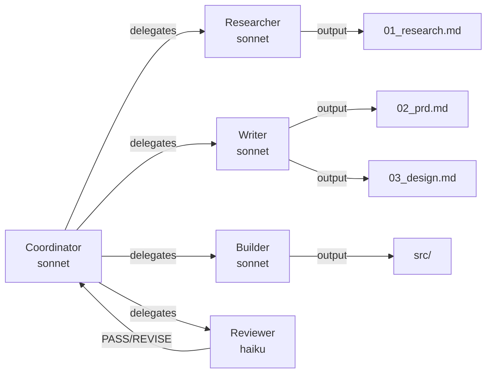

# build-pipeline

[](LICENSE)
[](https://docs.anthropic.com/en/docs/claude-code)
[](https://ui.shadcn.com)

> **Agentic build pipeline for Claude Code** — AI agents that research, plan, design, and build production-ready apps. Writer and reviewer agents are fully separated to prevent self-approval. Reviewer runs on Haiku for cost efficiency.



## Quick Start

```bash
# Copy to your project
cp -r build-pipeline/{.claude,checklists,prompts,CLAUDE.md} ./

# Run Claude Code
claude

# Start pipeline
> "I want to build a habit tracker app. Run the build pipeline."
```

> [!NOTE]
> Requires Claude Code CLI. Install: `npm install -g @anthropic-ai/claude-code`

## How It Works

Each phase goes through **dual verification**:

| Step | What | Cost |
|------|------|------|
| 1. Writer agent creates deliverable | sonnet | $$ |
| 2. Mechanical checklist (grep) | free | $0 |
| 3. Reviewer agent evaluates | **haiku** | **$** |
| 4. PASS → next phase / REVISE → fix & retry (max 2x) | — | — |

```
Research → PRD → Design → Build → QA
   ↓ REVISE    ↓ REVISE   ↓ REVISE
   → fix       → fix      → fix
```

### Agent Roles

| Role | Agent | Model | Why |
|------|-------|-------|-----|
| Research | `researcher.md` | sonnet | Needs web search + analysis |
| PRD / Design / Plan | `writer.md` | sonnet | Needs creativity + structure |
| Review | `reviewer.md` | **haiku** | Checklist-based, low reasoning needed |
| Build | `builder.md` | sonnet | Code generation |
| QA | main session | sonnet | Browser testing |

> [!TIP]
> Swap models by editing `model:` in `.claude/agents/*.md`. Use `opus` for complex tasks, `haiku` to save costs.

## Deliverables

| Phase | Output | Verified By |
|-------|--------|-------------|
| Research | `01_research.md` — market, competitors, pain points, personas | 21 checklist items + reviewer |
| PRD | `02_prd.md` — user stories (BDD), RICE, onboarding, UX copy | 19 checklist items + reviewer |
| Design | `03_design.md` + `tokens.json` — visual spec, components, 4-state | 10 checklist items + reviewer |
| Build | `src/` — working Next.js app | `npm run build` |
| QA | `05_integrate.md` — test report | Functional + visual + responsive |

### Designer Perspective (not just developer-centric)

- Emotional journey mapping in Research
- Onboarding experience design in PRD (1min / 5min / 1day)
- UX copywriting guide with actual sentences
- Color psychology with reasoning
- Anti-AI design checklist (10 items)

## Project Structure

```
your-project/
├── CLAUDE.md                 # Coordinator instructions
├── .claude/agents/
│   ├── researcher.md         # Research agent (sonnet)
│   ├── writer.md             # PRD/Design/Plan writer (sonnet)
│   ├── reviewer.md           # Quality reviewer (haiku)
│   └── builder.md            # Build engineer (sonnet)
├── prompts/
│   ├── 01_research.md
│   ├── 02_prd.md
│   ├── 03_design.md
│   ├── 04_build.md
│   └── 05_integrate.md
├── checklists/
│   ├── research.sh           # 21 items
│   ├── prd.sh                # 19 items
│   ├── design.sh             # 10 items
│   └── run-all.sh
└── .ralph/                   # Generated during pipeline
    ├── state.json
    ├── outputs/
    │   ├── 01_research.md
    │   ├── 02_prd.md
    │   ├── 03_design.md
    │   └── 05_integrate.md
    └── phase_summaries/
```

## Tech Stack

| Layer | Default | Notes |
|-------|---------|-------|
| Framework | Next.js (App Router) | Static export |
| Language | TypeScript (strict) | — |
| Components | shadcn/ui v4 (base-ui) | **asChild removed in v4** |
| Styling | Tailwind CSS v4 | Design tokens as CSS vars |
| Deployment | Static export | `output: 'export'` in next.config.ts |

> [!WARNING]
> shadcn/ui v4 uses base-ui instead of Radix. The `asChild` prop is **completely removed**. Use direct children instead: `<SheetTrigger>Open</SheetTrigger>`

## Customization

**Change agent model:**
```yaml
# .claude/agents/reviewer.md
model: opus    # For thorough reviews
model: haiku   # For cost savings (default)
```

**Change tech stack:** Edit `CLAUDE.md` and `builder.md`.

**Add checklist items:** Edit `checklists/*.sh` — simple grep patterns.

## FAQ

**Q: Can I use this with Codex CLI?**
A: Not yet. Codex edition is planned. The prompts and checklists are reusable.

**Q: Can I skip phases?**
A: Yes. You can manually start from any phase if you have existing docs.

**Q: How much does one full pipeline run cost?**
A: Roughly $0.50–2.00 depending on project complexity. Reviewer (haiku) is the cheapest part.

**Q: Does it work without Claude Code?**
A: The `.claude/agents/` format is Claude Code specific. The prompts and checklists work with any AI.

## License

MIT
